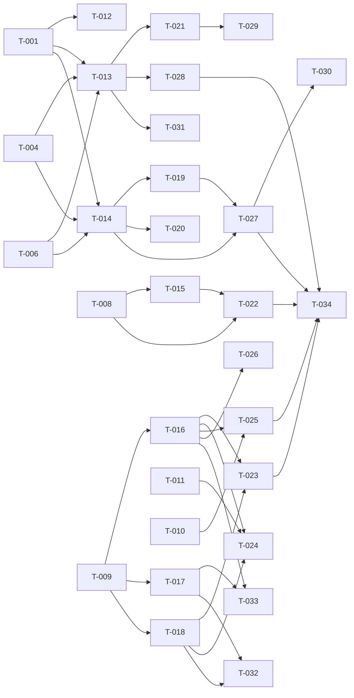

# Build Site

34 tasks across 5 tiers from 3 kits.

---

## Tier 0 — No Dependencies (Start Here)

| Task | Title | Cavekit | Requirement | Effort |
|------|-------|---------|-------------|--------|
| T-001 | OpenRouter adapter — streaming chat completion | cavekit-model-gateway.md | R1 | M |
| T-002 | OpenRouter adapter — model selection forwarding | cavekit-model-gateway.md | R1 | S |
| T-003 | OpenRouter adapter — structured error handling | cavekit-model-gateway.md | R1 | S |
| T-004 | Ollama adapter — streaming chat completion with configurable host | cavekit-model-gateway.md | R2 | M |
| T-005 | Ollama adapter — unreachable host error handling | cavekit-model-gateway.md | R2 | S |
| T-006 | LM Studio adapter — streaming chat completion with configurable host | cavekit-model-gateway.md | R3 | M |
| T-007 | LM Studio adapter — unreachable host error handling | cavekit-model-gateway.md | R3 | S |
| T-008 | Subject-specific system prompts for all six subjects | cavekit-education-core.md | R1 | M |
| T-009 | Conversation persistence — SQLite schema and write path | cavekit-education-core.md | R3 | M |
| T-010 | Markdown rendering component with syntax highlighting | cavekit-chat-ui.md | R3 | M |
| T-011 | Mobile-friendly responsive layout foundation | cavekit-chat-ui.md | R8 | M |

---

## Tier 1 — Depends on Tier 0

| Task | Title | Cavekit | Requirement | blockedBy | Effort |
|------|-------|---------|-------------|-----------|--------|
| T-012 | API key isolation — server-side injection, no client leakage | cavekit-model-gateway.md | R6 | T-001 | S |
| T-013 | Streaming delivery — unified streaming format across providers | cavekit-model-gateway.md | R7 | T-001, T-004, T-006 | M |
| T-014 | Runtime provider switching — switch takes effect on next call | cavekit-model-gateway.md | R4 | T-001, T-004, T-006 | M |
| T-015 | Educational guardrails — shared base injected into all prompts | cavekit-education-core.md | R2 | T-008 | S |
| T-016 | Conversation retrieval — full history and conversation list | cavekit-education-core.md | R4 | T-009 | M |
| T-017 | Conversation metadata — title, subject, model, timestamps | cavekit-education-core.md | R5 | T-009 | M |
| T-018 | Conversation lifecycle — create, delete, not-found handling | cavekit-education-core.md | R6 | T-009 | M |

---

## Tier 2 — Depends on Tier 1

| Task | Title | Cavekit | Requirement | blockedBy | Effort |
|------|-------|---------|-------------|-----------|--------|
| T-019 | Model list endpoint — fetch models from active provider | cavekit-model-gateway.md | R5 | T-014 | S |
| T-020 | Model list endpoint — structured error on unreachable provider | cavekit-model-gateway.md | R5 | T-014 | S |
| T-021 | Streaming response display — incremental tokens and indicator | cavekit-chat-ui.md | R2 | T-013 | M |
| T-022 | Subject selector component | cavekit-chat-ui.md | R4 | T-008, T-015 | S |
| T-023 | Conversation sidebar — list, select, new, delete controls | cavekit-chat-ui.md | R6 | T-016, T-018 | M |
| T-024 | Conversation sidebar — collapsible on small screens | cavekit-chat-ui.md | R6 | T-016, T-018, T-011 | S |

---

## Tier 3 — Depends on Tier 2

| Task | Title | Cavekit | Requirement | blockedBy | Effort |
|------|-------|---------|-------------|-----------|--------|
| T-025 | Chat message display — user/tutor styling, chronological order, auto-scroll | cavekit-chat-ui.md | R1 | T-016, T-010 | M |
| T-026 | Chat message display — empty state when no conversation active | cavekit-chat-ui.md | R1 | T-016 | S |
| T-027 | Model picker — provider switch, model list, model selection | cavekit-chat-ui.md | R5 | T-019, T-014 | M |
| T-028 | Message composition — input area, send control, keyboard shortcut | cavekit-chat-ui.md | R7 | T-013 | S |
| T-029 | Message composition — clear on send, disable during streaming | cavekit-chat-ui.md | R7 | T-021 | S |

---

## Tier 4 — Integration and Polish

| Task | Title | Cavekit | Requirement | blockedBy | Effort |
|------|-------|---------|-------------|-----------|--------|
| T-030 | Model picker — list refreshes on provider switch | cavekit-chat-ui.md | R5 | T-027 | S |
| T-031 | Streaming terminal signal handling | cavekit-model-gateway.md | R7 | T-013 | S |
| T-032 | Conversation auto-title from first user message | cavekit-education-core.md | R5 | T-017, T-018 | S |
| T-033 | Conversation list ordered by most recently active | cavekit-education-core.md | R4 | T-016, T-017 | S |
| T-034 | Mobile layout verification — all interactive elements, input pinned to bottom | cavekit-chat-ui.md | R8 | T-025, T-028, T-022, T-027, T-023 | M |

---

## Summary

| Tier | Tasks | Effort |
|------|-------|--------|
| 0 | 11 | 4S + 6M + 1M |
| 1 | 7 | 2S + 5M |
| 2 | 6 | 3S + 3M |
| 3 | 5 | 2S + 3M |
| 4 | 5 | 3S + 1M + 1M |

**Total: 34 tasks, 5 tiers**

---

## Coverage Matrix

| Cavekit | Req | Criterion | Task(s) | Status |
|---------|-----|-----------|---------|--------|
| model-gateway | R1 | Chat completion request with system prompt and message history returns streamed response | T-001 | COVERED |
| model-gateway | R1 | Adapter forwards model selection to OpenRouter | T-002 | COVERED |
| model-gateway | R1 | OpenRouter API errors surface as structured error with human-readable message | T-003 | COVERED |
| model-gateway | R2 | Chat completion via Ollama adapter connects to configurable host (default localhost:11434) and returns streamed response | T-004 | COVERED |
| model-gateway | R2 | Ollama unreachable returns structured error indicating local service unavailable | T-005 | COVERED |
| model-gateway | R3 | Chat completion via LM Studio adapter connects to configurable host (default localhost:1234) and returns streamed response | T-006 | COVERED |
| model-gateway | R3 | LM Studio unreachable returns structured error indicating local service unavailable | T-007 | COVERED |
| model-gateway | R4 | Switch from one provider to another takes effect on next call without restart | T-014 | COVERED |
| model-gateway | R4 | After switching, subsequent requests route to newly selected provider | T-014 | COVERED |
| model-gateway | R5 | Requesting model list from active provider returns array of model identifiers | T-019 | COVERED |
| model-gateway | R5 | If provider unreachable, endpoint returns structured error rather than empty list | T-020 | COVERED |
| model-gateway | R6 | API key is read from server-side environment variable | T-012 | COVERED |
| model-gateway | R6 | No API response or client-facing payload contains the API key | T-012 | COVERED |
| model-gateway | R6 | Browser requests do not need to include API key; server injects it | T-012 | COVERED |
| model-gateway | R7 | Gateway emits tokens incrementally as they arrive, not buffered | T-013 | COVERED |
| model-gateway | R7 | Streaming format is consistent regardless of active provider | T-013 | COVERED |
| model-gateway | R7 | Stream includes terminal signal so consumer knows when response is complete | T-031 | COVERED |
| education-core | R1 | System prompts exist for all six subjects | T-008 | COVERED |
| education-core | R1 | Math prompt instructs tutor to encourage showing work and step-by-step reasoning | T-008 | COVERED |
| education-core | R1 | English prompt instructs tutor to ask about essay/writing goals before diving in | T-008 | COVERED |
| education-core | R1 | Each subject prompt retrievable by subject identifier | T-008 | COVERED |
| education-core | R1 | Selecting a different subject returns a different system prompt | T-008 | COVERED |
| education-core | R2 | Every subject prompt contains instructions to stay on educational topics | T-015 | COVERED |
| education-core | R2 | Every subject prompt contains instructions to keep content appropriate for middle/high school | T-015 | COVERED |
| education-core | R2 | Every subject prompt contains instructions to avoid off-topic or inappropriate content | T-015 | COVERED |
| education-core | R2 | Guardrail text is consistent across all six prompts (shared base) | T-015 | COVERED |
| education-core | R3 | When a message is added, it is written to persistent storage | T-009 | COVERED |
| education-core | R3 | After app restart, previously stored conversations are still retrievable | T-009 | COVERED |
| education-core | R3 | No external database service required; storage is local | T-009 | COVERED |
| education-core | R4 | Given a conversation ID, full message history returned in chronological order | T-016 | COVERED |
| education-core | R4 | List of all conversations retrievable, returning metadata not full bodies | T-016 | COVERED |
| education-core | R4 | Conversation list ordered by most recently active first | T-033 | COVERED |
| education-core | R5 | Each conversation has auto-generated title from first user message | T-032 | COVERED |
| education-core | R5 | Each conversation records which subject was selected | T-017 | COVERED |
| education-core | R5 | Each conversation records which model was used | T-017 | COVERED |
| education-core | R5 | Each conversation records a creation timestamp | T-017 | COVERED |
| education-core | R5 | Each conversation records a last-updated timestamp | T-017 | COVERED |
| education-core | R6 | Creating a new conversation returns a unique conversation identifier | T-018 | COVERED |
| education-core | R6 | New conversation is associated with selected subject and model | T-018 | COVERED |
| education-core | R6 | Deleting a conversation removes it and all messages from storage | T-018 | COVERED |
| education-core | R6 | Attempting to retrieve a deleted conversation returns not-found | T-018 | COVERED |
| chat-ui | R1 | User and tutor messages are visually distinguishable | T-025 | COVERED |
| chat-ui | R1 | Messages appear in chronological order | T-025 | COVERED |
| chat-ui | R1 | Most recent message visible without manual scrolling (auto-scroll) | T-025 | COVERED |
| chat-ui | R1 | Empty state shown when no conversation active | T-026 | COVERED |
| chat-ui | R2 | While streaming, tokens appear incrementally in tutor message bubble | T-021 | COVERED |
| chat-ui | R2 | Visual indicator signals response is still generating | T-021 | COVERED |
| chat-ui | R2 | Once streaming completes, indicator disappears and message is final | T-021 | COVERED |
| chat-ui | R2 | User can see partial responses while generating | T-021 | COVERED |
| chat-ui | R3 | Headers, bold, italic, links render as formatted text | T-010 | COVERED |
| chat-ui | R3 | Ordered and unordered lists render with proper indentation | T-010 | COVERED |
| chat-ui | R3 | Fenced code blocks render with syntax highlighting and monospace | T-010 | COVERED |
| chat-ui | R3 | Inline code renders with distinct background or style | T-010 | COVERED |
| chat-ui | R4 | All six subjects are selectable | T-022 | COVERED |
| chat-ui | R4 | Currently active subject is visually indicated | T-022 | COVERED |
| chat-ui | R4 | Selecting subject when starting new conversation associates it | T-022 | COVERED |
| chat-ui | R4 | Subject selector accessible before or at start of new conversation | T-022 | COVERED |
| chat-ui | R5 | Model picker displays list of available models from active provider | T-027 | COVERED |
| chat-ui | R5 | User can select a model for subsequent messages | T-027 | COVERED |
| chat-ui | R5 | User can switch active provider | T-027 | COVERED |
| chat-ui | R5 | Model list refreshes when provider is switched | T-030 | COVERED |
| chat-ui | R6 | Sidebar displays past conversations with title and timestamp | T-023 | COVERED |
| chat-ui | R6 | Selecting conversation loads full message history in chat view | T-023 | COVERED |
| chat-ui | R6 | Control to start new conversation is present and visible | T-023 | COVERED |
| chat-ui | R6 | Control to delete conversation available for each listed conversation | T-023 | COVERED |
| chat-ui | R6 | Sidebar can be collapsed or hidden on smaller screens | T-024 | COVERED |
| chat-ui | R7 | Text input area present for composing messages | T-028 | COVERED |
| chat-ui | R7 | User can submit via send control or keyboard shortcut | T-028 | COVERED |
| chat-ui | R7 | Input area cleared after message sent | T-029 | COVERED |
| chat-ui | R7 | Send control disabled while response is streaming | T-029 | COVERED |
| chat-ui | R8 | On 480px or narrower, all interactive elements reachable without horizontal scrolling | T-034 | COVERED |
| chat-ui | R8 | On mobile, sidebar does not permanently obscure chat area | T-024, T-034 | COVERED |
| chat-ui | R8 | Message bubble text readable without zooming (min 14px) | T-011 | COVERED |
| chat-ui | R8 | Input area remains accessible (fixed to bottom) while scrolling | T-011, T-034 | COVERED |

**Coverage: 74/74 criteria (100%)**

---

## Dependency Graph

